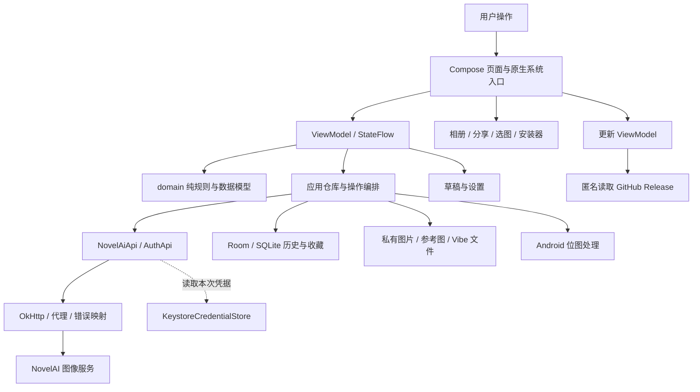

# PocketNAI 架构说明与功能拆解

> 阅读对象：需要理解现有 Android 实现，或准备以 Swift / SwiftUI、Windows 原生技术重新实现 PocketNAI 的开发者。
>
> 基线：2026-09-21 工作区，Git HEAD `0794fbb64d59481b3c8e1d3a497dda4835dd957c`。本文依据当前源码、数据库实体、测试和仓库约定整理；没有发起真实登录、生成、编码或放大请求。服务端协议与计价描述是**本版本实现采用的契约**，不是对未来服务端行为的保证。
>
> 本次只增加架构文档，不实施移植，也不修改应用行为。下文明确区分“当前实现”“必须保留的产品约束”和“移植前需要决定的缺口”。旧规划、注释与实现冲突时，以可执行代码描述现状；产品底线仍以仓库约定为准。

## 1. 先理解整个产品

PocketNAI 是一个以本地文件和历史数据库为中心的 NovelAI 图像客户端。应用负责编辑提示词、组织参考条件、计算报价、调用 NovelAI、保存图片、管理历史；图像模型在 NovelAI 服务端运行。本仓库没有自建生成后端、用户云端画廊、跨设备同步服务或本地推理引擎。

用户最常走的闭环是：

**编辑草稿 → 用户点击生成 → 固定本次参数 → 必要的参考图编码 → 请求服务端 → 校验并处理结果 → 本地保存 → 浏览、收藏、导出或再次复用。**

“把 Android 界面翻译成 SwiftUI”只能覆盖其中一部分。最需要完整保留的是：一次付费操作只能发一次；历史记录必须对应实际请求；参考图、蒙版与画布必须对齐；文件、数据库和草稿之间必须保持引用关系；费用预估和服务端余额不能混为一谈。

## 2. 文档导航

本文件负责全貌、功能覆盖和阅读路线。详细规则放在相互链接的专题中，避免把数万字堆成一页。

| 专题 | 主要回答的问题 |
|---|---|
| [01 界面、状态与提示词](architecture/01-界面状态与提示词.md) | 页面怎么组织？输入、草稿、补全、权重、收藏、角色怎样协作？ |
| [02 生成编排与网络协议](architecture/02-生成编排与网络协议.md) | 点生成之后发生什么？请求怎么组装？ZIP、SSE、失败与超分怎么收尾？ |
| [03 图片、蒙版与元数据](architecture/03-图片蒙版与元数据.md) | 参考图怎么转换？三个尺寸有什么区别？蒙版坐标、PNG 参数如何保全？ |
| [04 数据、历史与文件生命周期](architecture/04-数据历史与文件生命周期.md) | 六张表存什么？文件怎么落盘、恢复、删除、导出？ |
| [05 账号、计费、代理与更新](architecture/05-账号计费代理与更新.md) | 凭据怎么验证保存？报价和流水如何算？代理、更新有什么边界？ |
| [06 原生移植边界、缺口与验收](architecture/06-原生移植边界与验收.md) | 哪些规则应等价重写？哪些依赖系统？哪些现有限制不能照搬成保证？ |
| [07 源码与测试索引](architecture/07-源码与测试索引.md) | 每个模块具体去哪里读？已有测试分别守住什么？ |

推荐第一遍：本页 → 02 → 04 → 06。实现某个功能前，再读对应专题和源码入口。

## 3. 运行结构

这是单一 Android 应用模块内的分层，尚不是可直接被多个平台引用的共享库。`core/` 和 `domain/` 不依赖 Android API；不过有 JVM 标准库、kotlinx.serialization、Bouncy Castle 等依赖，因此“纯 Kotlin”不等于“源码可直接编译成 Swift”。

| 层 | 责任 | 典型入口 |
|---|---|---|
| `core` | 统一结果、错误码、哈希和脱敏 | `Outcome`、`AppError`、`Hashing` |
| `domain` | 模型能力、参数、几何、提示词、元数据、费用与更新判定 | `ModelCatalog`、`ResolutionPlanner`、`AnlasCostCalculator` |
| `data` | HTTP、Room、加密存储、图片转换、文件与仓库编排 | `GenerationRepository`、`OkHttpNovelAiApi`、`GenerationFileStore` |
| `ui` | 屏幕状态、用户操作、导航与系统交互 | `GenerateViewModel`、`HomeScreen`、`DetailViewModel` |
| `di` | 应用级对象装配与生命周期 | `AppContainer` |

源码并非完全遵循“所有业务逻辑都在 domain”：请求构造和 ZIP/SSE 解析虽然属于可独立测试的逻辑，但位于 `data/network`；生成完成后的余额核对和流水写入位于 ViewModel；蒙版编辑器直接构建 Android 图片处理器。移植时按**职责**划分，不要机械复制目录名称。

## 4. 启动与共享对象

1. `PocketNaiApplication.onCreate` 创建 `AppContainer`，手工装配依赖，没有 Hilt/Koin。
2. 容器创建凭据存储、会话状态、API、报价器等对象；数据库、文件仓库、部分设置和服务按需创建。容器注释称“所有成员懒加载”，但代码并非全部 `lazy`。
3. `MainActivity.onCreate` 启动 `cleanupOnStartup`，同时渲染界面。它不是阻塞首屏的完整恢复屏障。
4. `PocketNaiApp` 在导航之上持有生成和更新 ViewModel。当前有凭据则进入首页，否则进入连接页；本地“有凭据”不代表服务端已再次验证。
5. 页面订阅 StateFlow；数据库 Flow 推动画廊，预览 Store 提供临时采样帧。
6. 已连接、回到前台时按缓存策略刷新余额；启动约 3 秒后静默检查 GitHub 更新。

有四种容易混淆的共享状态：

| 对象 | 是否持久化 | 用途 |
|---|---|---|
| `GenerationDraftPreferences` | 是 | 保存正在编辑的参数、模板和参考图索引 |
| `GenerationDraftStore` | 否 | 详情页向生成页投递一次“复用参数”消息 |
| `GenerationPreviewStore` | 否 | 生成 ViewModel 向画廊发布临时预览路径与进度 |
| `GalleryOrderSnapshot` | 否 | 打开详情时冻结当前筛选结果的图片顺序 |

## 5. 功能覆盖地图

| 功能 | 用户入口和运行责任 | 详细说明 |
|---|---|---|
| PST 连接、实验性账号登录 | 连接页；先验证再保存凭据 | 05 §1–2 |
| 添加、切换、改名、删除账号 | 设置账号卡；`AccountAdder` + 凭据索引 | 05 §2 |
| 断开连接 | 清凭据与余额，历史仍是本地数据 | 05 §2 |
| 手机、平板/横屏布局 | 底部导航/侧栏、悬浮层/常驻面板 | 01 §1 |
| 正负提示词和选区 | 输入框拥有光标；外部替换使用 revision | 01 §3 |
| 权重操作及高亮 | `{}`、`[]`、数字权重的本地显示 | 01 §4 |
| Randomizer | 点击时展开 `<a\|b>`，保留本次快照 | 01 §4 |
| 标签补全 | 正向词、350ms 防抖、最多五条 | 01 §5 |
| 提示词/标签收藏 | 本地保存、去重、分组、追加与替换 | 01 §6 |
| 多角色 | 最多五个角色及横向位置 | 01 §7、02 §4 |
| 模型和生成参数 | 能力表驱动默认值、范围与组合 | 01 §2 |
| 自定义分辨率 | 目标、请求画布、输出图分离 | 03 §1 |
| 文生图与批量出图 | 一次请求内 `n_samples`，无自动循环 | 02 §1–3 |
| 图生图 | 导入起点图，提交时 Cover | 03 §2 |
| Precise Reference | 黑边画布与五个并行数组 | 03 §3、02 §4 |
| Vibe Transfer | 点击后编码、缓存、三个并行数组 | 03 §4 |
| 局部重绘 | 底图准备、笔画编辑、8×8 蒙版与 infill | 03 §5 |
| 图片元数据导入 | 原图先读 PNG 文本，再归一化图片 | 03 §6 |
| 实验性流式预览 | SSE 中间帧进缓存，最终图进历史 | 02 §5 |
| 画廊、日期分组和搜索 | 全量本地数据流与纯函数筛选 | 04 §4 |
| 图片收藏、多选 | 图片级收藏；批量保存/分享/删除 | 04 §4–6 |
| 详情、左右翻页和缩放 | 顺序快照、懒加载、1–8 倍缩放 | 04 §5 |
| 复用参数、复制提示词 | 填回编辑区或系统剪贴板 | 01 §3、04 §5 |
| 高清放大 | 用户确认后单独请求，保存新图 | 02 §6 |
| 保存相册、分享 | 复制原文件、系统授权读取 | 04 §7 |
| 撤销删除、清理图片、孤儿维护 | 三种不同生命周期操作 | 04 §6 |
| 余额、订阅覆盖、费用估算 | 服务端事实和本地规则分别管理 | 05 §3–4 |
| Anlas 流水 | 本机观察值；不是服务端账单 | 05 §5 |
| 公益/自定义代理 | NovelAI 专用链路、切换与额度 | 05 §6 |
| 主题、实验开关与设置记忆 | 设置首选项与主题状态流 | 01 §8 |
| 更新检查、下载、安装、发布 | GitHub Release 和系统安装器 | 05 §7 |

不应计入“已实现功能”的项目：Google SSO/Cookie 登录、云端历史同步、任意自动生成队列、导演工具 `/ai/augment-image`、完整跨平台数据包导入导出。`Enhance` 也没有独立产品入口。服务端相关历史研究见技术决策记录，不能把研究条目当作现有按钮。

## 6. 关键数据词汇

| 名称 | 精确含义 |
|---|---|
| 草稿 `GenerationDraft` | 用户还在编辑的状态，可覆盖保存 |
| 参数 `GenerationParams` | 模型、文本、画布、采样、Seed、质量标签、角色等值 |
| 请求 `GenerationRequest` | 参数 + 生成方式 + 参考图列表；还不是 HTTP JSON |
| 有效参数 `effectiveParams` | 经过规范化，并且随机 Seed 已经确定的本次参数 |
| 生成 `Generation` | 一次操作/一批输出的父记录；含状态与参数快照 |
| 图片 `GeneratedImage` | 一张实际文件；有自己的 id、序号、真实宽高、hash |
| 参考素材 `ReferenceImage` | 被某次请求使用的图片及其角色/强度；文件可跨记录共用 |
| 报价 `GenerationCostEstimate` | 本地根据参数和权益推算的四态结果 |
| 余额 `SubscriptionBalance` | 从服务器读取的账户状态快照 |
| 观察变化 `ObservedBalanceChange` | 两次余额快照之间的差，不能证明全部由本次操作产生 |

特别注意：Vibe 是可叠加的参考条件，不是 `GenerationMode` 的一个枚举项；Characters 也是请求参数，不是生成方式；超分是一个独立操作，但借用 `Generation` 存储结果。

## 7. 移植必须保留的行为

1. 真实生成、Vibe 编码和放大只因用户明确操作而发生；不因恢复草稿、导入元数据、重试或测试而自动发生。
2. 网络结果不确定时不给“肯定没有扣费”的承诺，也不自动重发付费请求。
3. 随机 Seed 只产生一次，请求和历史使用同一份值；批量每张 Seed 不知道就留空。
4. 草稿、历史、临时预览、服务器余额、凭据有不同生命周期，不能塞进一个通用状态文件。
5. 参考图共享文件按活引用回收；活引用必须包含草稿。
6. 生成画布与最终图片尺寸分开；任何平台都必须在正式落盘前裁切并保全必要 PNG 元数据。
7. 输入法选区归输入控件所有，普通按键更新不反向重建输入框。
8. 凭据保存在系统安全设施中；历史、日志、导出图片和分享附件不携带凭据。
9. 余额失败不阻断生成；报价、余额变化、服务端扣费事实分别表达。
10. 当前实现中尚未满足的保证要先列为待决策项，见 [06](architecture/06-原生移植边界与验收.md)，不能因架构文档写得整齐就视为已经具备。

## 8. 与既有文档的关系

- [规划书草案](PocketNAI-规划书草案.md)：产品目标与最初范围。
- [技术决策记录](PocketNAI-技术决策记录.md)：协议验证、历史问题与选择理由。
- [参考图功能规划书](PocketNAI-参考图功能规划书.md)、[局部重绘功能规划书](PocketNAI-局部重绘功能规划书.md)：分阶段实施背景。
- [双认证模式实施计划](PocketNAI-双认证模式实施计划.md)、[余额与费用系统规划](PocketNAI-余额与Anlas费用系统实施规划.md)：对应子系统的设计意图。
- 本文和七篇专题：**当前源码如何运行，以及原生重写时要保留/重新决定的边界**。

后续修改功能时，应同时检查：业务规则、请求 JSON、草稿 DTO、历史实体/迁移、元数据读写、报价、对应测试和本文功能地图。它们经常不是同一个文件里的改动。
