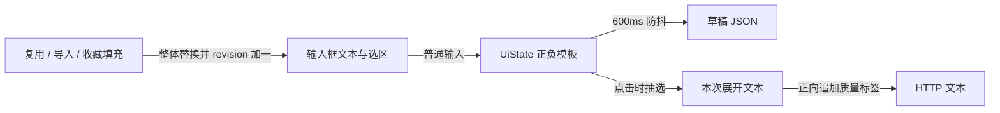

# 01 · 界面、状态与提示词

[返回架构总览](../PocketNAI-架构说明与功能拆解.md) · [下一篇：生成编排](02-生成编排与网络协议.md)

## 1. 页面与生命周期

导航目的地为 `connect`、`home`、`settings`、`detail/{imageId}`、`inpaint`。只有首页和设置出现在主导航。详情与蒙版编辑器为独立页面，连接成功会移除连接页返回栈。

`PocketNaiApp` 持有生成 ViewModel，传入 `HomeScreen`，所以切换画廊/设置不会重新创建草稿或中止界面级生成任务。详情、画廊、设置各有自身 ViewModel。历史选图对话框使用 `history-image-picker` 独立 key，避免继承主画廊的筛选条件。

当前宽度分档是两个独立判断：

| 条件 | 导航 | 编辑器 |
|---|---|---|
| 根布局宽度 <600dp | 底部 NavigationBar | 通常为底部悬浮层 |
| 根布局宽度 ≥600dp | 左侧 NavigationRail | 内容宽度不足720dp时仍用悬浮层 |
| Rail 之后内容宽度 ≥720dp | 左侧导航 | 画廊 + 右侧400dp常驻生成面板 |

画廊使用自适应160dp最小列宽的瀑布流。不要把600和720当成同一个屏幕断点。

手机悬浮层初始半展开，peek 为112dp，禁止彻底隐藏。生成开始时收起。头部包含标题、参数摘要、状态/余额和生成按钮；表单滚动时按钮仍可见。状态优先级为未连接 → 生成中 → 错误 → 提示词为空 → 余额。余额不能盖住错误。

表单内部滚动一直挂载，只在收起时禁用手势；顶部空白放在滚动区域外。这样展开动画不会先回到表单顶部再跳回旧位置，也不会在收起态露出半行文字。

布局顺序是提示词、角色/参数与高级选项、最底部参考图区。图生图/Precise/Vibe 在同一卡片内切页；**切页本身不清空参考条件**，只有实际挂图的业务操作才处理互斥。说明文字进入信息按钮弹层。设置页采用账号卡片和“标题 + 当前值 + 进入箭头”的分组行。

源码：[导航与根状态](../../app/src/main/java/net/pocketnai/ui/PocketNaiApp.kt)、[响应式首页](../../app/src/main/java/net/pocketnai/ui/home/HomeScreen.kt)、[生成表单](../../app/src/main/java/net/pocketnai/ui/generate/GenerateSheet.kt)。

## 2. 参数表不是一堆独立输入框

`ModelCatalog → ModelProfile → GenerationParams` 构成参数约束。界面读取能力表决定选项；ViewModel 处理修改；请求构造前再次 normalize。换模型尝试保留原值，不适用的采样器/调度/尺寸改为目标默认值并产生说明。

| 项目 | 当前客户端值 |
|---|---|
| 模型 | V4.5 Curated、V4.5 Full、V5 Curated、V5 Full |
| 默认模型 | V4.5 Curated |
| 默认画布 | V4.5 为832×1216；V5 为1024×1024 |
| Normal | 832×1216、1216×832、1024×1024 |
| Large | 1024×1536、1536×1024、1536×1536 |
| 张数 | 1–4，默认1；一次请求中的张数，不是自动多次请求 |
| Steps | 1–50，默认23 |
| Guidance | 0–10，默认7.0，步进0.1 |
| CFG Rescale | 0–1，默认0，步进0.05 |
| 默认采样 | Euler Ancestral + Karras |
| Seed | RANDOM/FIXED；无符号32位语义，范围0到4,294,967,295 |
| UC预设 | Heavy=0、Light=1、Human Focus=2、None=3，默认Heavy |
| 质量标签 | Standard / Light / None，默认Standard |
| 提示词软上限 | V4.5为1000字符、V5为2000；提醒而不阻断 |

七个采样器中，DPM++ 2S Ancestral 不开放 Karras，DDIM 只允许 Native；其他已列采样器支持 Native/Karras/Exponential/Polyexponential。改变采样器会重新选择合法调度。

`normalize` 的作用包括夹取数值、替换非法组合/画布、清除超出画布的 outputSize。它是容错，不是严格拒绝所有非法输入。因此其他平台不能只把 `validate` 和 `normalize` 合并成一个“报错”函数，否则旧草稿恢复行为会改变。自定义尺寸存在规划器与模型护栏不一致的边界，见03和06。

`canGenerate` 当前只包含 `!inFlight && !referenceBusy && promptTemplate非空`。连接状态由 UI 和仓库另外检查；参考合法性由仓库检查。不要把这个属性误认为完整请求验证结果。

## 3. 四种提示词状态与一次外部替换

`TextFieldValue` 同时保存文本与选区。用户打字只向 ViewModel 上报，不通过 effect 把每次 ViewModel 更新再覆盖回输入框。外部整段替换才增加 `textRevision`，界面以 `remember(textRevision)` 重建输入状态。这样连续删除、输入法组合文字和拖动选区不会被上一拍文本打断。

具体入口：

- 普通输入：`onPromptChange` / `onNegativePromptChange`，不增加 revision。
- 收藏追加或替换：`replacePromptText(target, text)`，同步模板和参数并增加 revision。
- 元数据确认：一次 state 更新同时写正负模板、参数、质量标签、模型与尺寸，再增加 revision。
- 历史复用：详情投递 `GenerationRequest`，生成页消费一次，恢复参考图并增加 revision。

历史复用当前使用 `generation.params.prompt/negativePrompt` 作为新模板，也就是上次抽选后的实际文本；虽然历史另存正向 `promptTemplate`，此入口不拿它恢复随机候选。负向原模板没有独立历史列。Seed 模式保持原记录的模式；上次为 RANDOM 时直接复用仍会再次随机，精确复现需使用已知 Seed 并选 FIXED。

## 4. 提示词工具

### 4.1 拼接与质量标签

所有片段追加都经过 `PromptComposition.append`，统一处理末尾逗号、空白与空文本。质量标签只在请求构造时追加到正向文本：

| 选项 | 后缀 |
|---|---|
| Standard | `very aesthetic, masterpiece, no text` |
| Light | `very aesthetic, amazing quality, no text` |
| None | 不追加 |

`qualityToggle` 始终为 false，防止服务端再次追加。编辑区和数据库里的 `params.prompt` 不自动包含这次客户端追加的质量后缀；这是“保存的基础提示词”和“实际 HTTP input”的一个有意区别。不能在读历史时再把后缀直接拼进模板而保留原质量选项。

### 4.2 强化、弱化与高亮

强化给选中内容包 `{}`，弱化包 `[]`；当前按钮只在存在选区时启用，空白选区不修改。修改后维持选中，方便连续叠加强弱层数。`EmphasisSyntax.strengthOf` 使用每层1.05与其倒数，混合嵌套可相互抵消。

`PromptWeightScanner` 输出文本范围和权重，`WeightHighlightedTextField` 利用文字布局坐标画每行圆角背景：小于1为绿，大于1为红，等于1不画。数字写法如 `0.9::tag ::` 支持本地高亮，但不能将此直接表述为已验证的服务端语法。

底纹与输入框必须同尺寸同原点；只改变背景，不改变文字颜色。深色主题显式使用 `onSurface`，避免 BasicTextField 未指定色回落到黑色。若移植后输入框改为固定高度且内部滚动，绘制范围必须补偿滚动偏移。

### 4.3 Randomizer

`PromptRandomizer` 扫描 `<候选A|候选B>`，点击生成时每组抽一个非空候选。规则是：候选先trim并去空；不足两个候选则整组保留字面值；未闭合括号保留；`\<` 表示字面 `<`；不是支持任意嵌套的表达式语言。组合数为各组候选数乘积，溢出饱和为 Long 最大值。

正向和负向模板各展开一次，同一批输出共享展开结果；并非每张图重新抽选。Characters 文本没有走此展开入口。

源码：[提示词规则目录](../../app/src/main/java/net/pocketnai/domain/prompt)、[质量标签](../../app/src/main/java/net/pocketnai/domain/model/QualityTags.kt)。

## 5. 标签补全

只针对正向输入框光标所在标签。`PromptTagEditing.tagSpanAt` 以逗号/换行定位整个标签并去除边缘空白；光标在词中也替换整个片段。位于文本末尾时附加 `, `，后面已有内容则保留原尾部。

片段与模型组成查询键 → 350ms防抖 → 去重 → `collectLatest` → `TagSuggestionSource` → GET suggest-tags。少于两个字符不请求。无凭据或请求失败返回空建议，不污染生成错误。最多显示五条，界面还对比 `suggestionQuery` 与当前标签，丢弃过期结果。建议使用服务端结果，不能假定为严格前缀匹配。

移植需同时保留异步取消/失效判断和文本区间计算；只做防抖仍可能让迟到响应覆盖新输入。

## 6. 提示词收藏

提示词框右上角书签是入口。有选区存 TAG，无选区存 PROMPT；同时保存正向/负向 target、名称、分类与时间。持久化在 `prompt_favorites`，不调用 NovelAI 用户内容接口。

仓库将内容trim，空内容不写；同 `target + kind + content` 不重复插入。列表按最近使用时间排序；UI支持搜索、类型切换和分类。默认操作为追加，菜单提供整条替换及删除；使用后更新 `lastUsedAt`。填入最终走前述外部替换入口。

图片收藏完全是另一套数据，以图片id关联 `favorite_images`，不要与提示词收藏合并。

## 7. 多角色

最多5条 `CharacterPrompt`。每条有id、正向词、负向词、centerX/Y。UI位置为左0.15、偏左0.32、中0.5、偏右0.68、右0.85，y恒0.5。底层模型能存Double坐标，当前UI没有自由拖拽和纵向位置编辑。

请求构造过滤正负文本都为空的条目，剩余条目保持相同顺序进入正负 `char_captions`。有实际角色时正向块 `use_coords=true`。基础正向质量标签不会自动追加到每个角色。

角色进入草稿 JSON，重启可恢复；**当前 schema v7 的历史记录未持久化 characters**，所以历史复用会丢角色。元数据解析能识别角色内容，但导入计划仍只提示角色数量，不导入角色。旧文档“未实现多角色”已经过时，准确状态是“编辑和请求已实现，历史/导入闭环尚不完整”。

## 8. 草稿和设置

`GenerateViewModel` 从草稿同步初始化，避免页面先显示默认值再闪成历史值。状态流映射成 `GenerationDraft`，去重后600ms防抖保存。短于防抖窗口的最后一次编辑遇到进程终止可能未保存。

DTO含正负模板、所有主要参数、自定义尺寸、角色、参考素材索引；不含Token、图片字节、网络进行中状态、补全建议或可撤销笔画栈。旧单图字段 `reference` 与新 `references` 兼容读取。未知字段忽略，未知枚举局部回退，数值交给profile规范化；JSON整体损坏才回默认草稿。恢复时丢弃“只有蒙版没有底图”的残留状态。

主题为跟随系统/浅色/深色，由 `SettingsStore → MainActivity → PocketNaiTheme` 生效；Android12+默认使用系统动态取色，较旧系统使用内置配色。动态取色是主题函数参数，当前设置页没有独立开关。流式预览默认false，订阅手动覆盖默认AUTO。它们都是本机全局设置，并非按账号隔离。当前草稿也只有一份，不是每账号一份。

蒙版笔画和扩张值只在生成 ViewModel 内存中保留；已渲染的蒙版文件可以随草稿恢复，但跨进程没有完整的可撤销编辑历史。

## 9. 原生重写时的状态分界

应分别建立：应用会话状态、编辑草稿状态、输入控件选区状态、一次生成任务快照、临时预览状态、历史查询状态、余额查询状态。SwiftUI 的 View 重建或 Windows 页面重新挂载不能成为清空草稿的理由。

UI更新应在平台主执行上下文，网络/数据库/位图处理离开主线程；任务持有者的生命周期应覆盖用户在首页和设置之间的导航。Android当前没有可靠后台续传服务，因此不要从“导航不取消”推导出“系统杀进程后仍可继续生成”。
