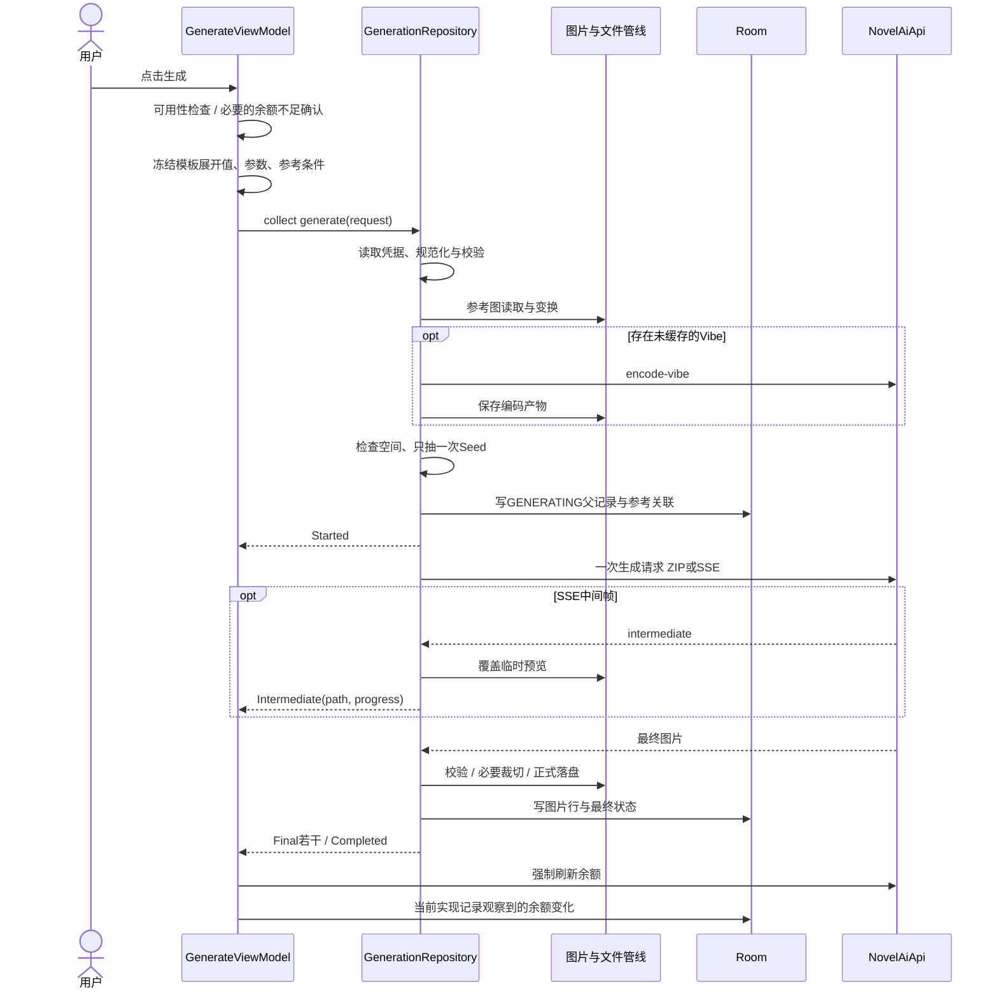
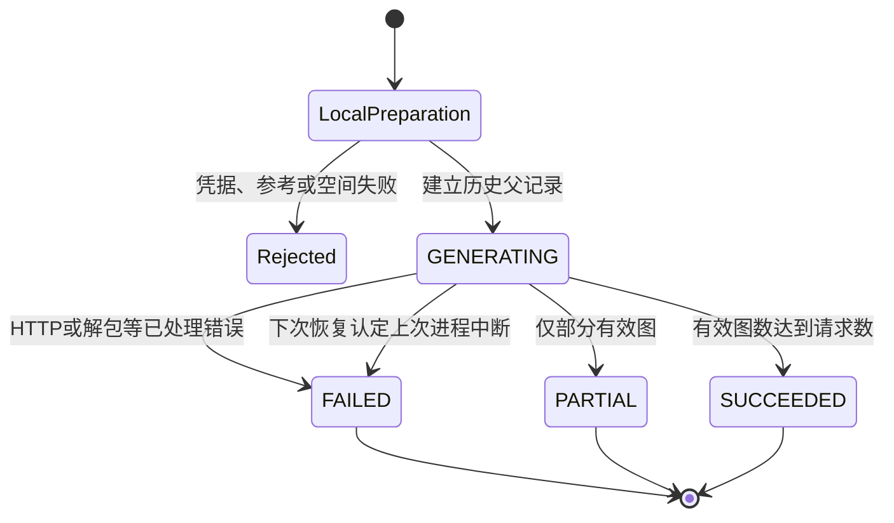

# 02 · 生成编排与网络协议

[返回架构总览](../PocketNAI-架构说明与功能拆解.md) · [图片处理](03-图片蒙版与元数据.md) · [存储](04-数据历史与文件生命周期.md)

## 1. 用户点击到结果显示

核心入口为 [GenerateViewModel](../../app/src/main/java/net/pocketnai/ui/generate/GenerateViewModel.kt) 的 `generate/startGeneration` 与 [GenerationRepository](../../app/src/main/java/net/pocketnai/data/repo/GenerationRepository.kt) 的 `generate`。后者返回冷 Flow，只有收集才执行操作。不要为多个观察者重复收集同一个生成冷流，否则会变成多次调用。

费用确认并非“所有付费生成都多弹一次”：普通生成按钮显示本地报价；仅当可计算具体金额、余额新鲜且报价大于余额时，生成 ViewModel 弹余额不足确认。用户点击本身就是生成授权。超分另有固定确认框。

## 2. 一次任务的准确执行顺序

| 阶段 | 输入/输出 | 失败语义 |
|---|---|---|
| 界面快照 | 正负模板分别Randomizer展开；copy到冻结params | 编辑后的新值不应改变已提交请求 |
| 本地校验 | 凭据存在；profile normalize/validate；参考文件存在及能力检查 | 返回FatalError，通常尚无历史父记录 |
| 参考预处理 | 按角色排序；图片编码；Vibe可能发编码请求 | 编码失败直接结束，可能已有Vibe编码费用 |
| 空间检查 | 画布像素×张数×4，再预留64MiB | STORAGE_FULL，无生成请求 |
| Seed与父记录 | 随机Seed只在此确定；保存同一份effectiveParams | 写入GENERATING和参考行 |
| HTTP载荷 | request.copy(params=effectiveParams)交给builder | 与历史共用Seed和画布 |
| 传输 | 默认ZIP，可选SSE | 不自动换另一条生成通道 |
| 图片处理 | 校验、裁切、metadata回写、hash/真实尺寸 | 具体限制见03；部分失败会保留原图 |
| 提交 | 正式文件先写，图片行后写，最后更新父状态 | 不是横跨文件和数据库的原子事务 |
| UI收尾 | Final增加计数，Completed清inFlight/预览 | 余额与流水是后续辅助流程 |

Vibe编码位于空间检查和GENERATING落库**之前**。因此“本地没有生成记录”不能证明没有发过付费编码请求。移植时可以重新设计更完整的操作账目，但必须显式决定，不能靠改变表述掩盖此边界。

一次请求中的多张图共用主prompt、角色、参考条件与baseSeed。单张输出保存已知Seed；多张输出的逐图Seed当前留空，因为服务端派生值未由客户端可靠读取。不要把baseSeed复制给每一张。

## 3. 状态、事件与恢复

父记录状态为 `GENERATING`、`SUCCEEDED`、`PARTIAL`、`FAILED`。有效图片数小于请求张数时为PARTIAL，其余为SUCCEEDED。零有效图片的ZIP解包会失败。

`GenerationEvent` 的六类定义为Started、Intermediate、Final、ItemError、Completed、FatalError。当前主路径不会实际发出ItemError；PARTIAL由返回数量判定。类型存在不等于实现了逐张重试或逐张失败诊断。

离开页面不是取消服务端操作。当前没有取消按钮、自动重试队列或服务端任务恢复查询；ViewModel生命周期结束、进程死亡仍会中断本地收集。下次启动把残留GENERATING改为FAILED/TIMEOUT_UNCERTAIN，告知结果不确定，绝不重发。

仓库目前只在选定分支捕获异常，不是所有磁盘/数据库/Flow异常都有统一finally收尾。数据库写入异常可能绕过正常Completed/FatalError，需作为移植验收项，详见06。

## 4. HTTP请求契约

NovelAI基地址由BuildConfig固定为 `https://image.novelai.net`；带凭据接口使用Bearer。登录是派生Access Key放在JSON，见05。

| 端点 | 方法 | 用途 | 触发 |
|---|---|---|---|
| `/user/data` | GET | PST/登录后凭据复验 | 用户连接、添加账号 |
| `/user/login` | POST | Access Key换会话Token | 用户实验性登录 |
| `/user/subscription` | GET | 余额、订阅、V5额度 | 连接/前台/手动/生成后 |
| `/ai/generate-image/suggest-tags` | GET | 模型相关标签建议 | 正向输入防抖后 |
| `/ai/generate-image` | POST | 一次普通生成 | 用户点击 |
| `/ai/generate-image-stream` | POST | 同一次生成的SSE版本 | 用户点击且开启实验开关 |
| `/ai/encode-vibe` | POST | 生成Vibe二进制编码 | 用户点击生成后的缓存未命中分支 |
| `/ai/upscale` | POST | 高清放大 | 用户确认 |

### 4.1 公共生成字段

顶层为 `input/model/action/parameters`。`input` 与正向caption相同，已经追加客户端质量标签。

| parameters字段 | 来源 |
|---|---|
| `params_version` | profile.paramsVersion，当前3 |
| `width/height` | generation画布，而非最终裁切尺寸 |
| `scale/cfg_rescale` | Guidance / CFG Rescale |
| `sampler/noise_schedule` | 枚举apiValue |
| `steps/n_samples/seed` | 有效参数快照 |
| `ucPreset` | UC索引 |
| `qualityToggle` | 固定false |
| `negative_prompt` | 展开后的基础负向文本 |
| `v4_prompt` | caption.base_caption、char_captions、use_coords、use_order |
| `v4_negative_prompt` | 对应负向caption结构，legacy_uc=false |
| `stream` | 仅流式时为`sse` |

四个模型都走这一套caption结构。角色项形如 `{char_caption, centers:[{x,y}]}`，正负数组从同一份过滤后的角色列表构造。空负向词发空串以保持角色对应。正向 `use_order=true`；有非空角色时 `use_coords=true`。

### 4.2 模式差异

| 场景 | action | model | 附加字段 |
|---|---|---|---|
| 文生图 | generate | 常规模型ID | 无image/mask |
| 图生图 | img2img | 常规模型ID | image + 顶层strength |
| Precise | generate | V4.5常规模型ID | 五个director数组 |
| 纯Vibe | generate | V4.5常规模型ID | 三个reference数组 |
| 图生图+Vibe | img2img | V4.5常规模型ID | image/strength和三个reference数组 |
| 局部重绘 | infill | 专用inpainting模型ID | image/mask + 重绘专用常量 |

`useInpaint` 同时要求请求mode、底图载荷和蒙版载荷齐全；action与model用同一判定，避免“infill + 常规模型”的矛盾。V5 Curated重绘映射到 `nai-diffusion-4-5-curated-inpainting`，其余对应自身 `-inpainting` ID。此映射必须按表保留。

重绘恒发 `add_original_image=false`、`sm=false`、`sm_dyn=false`、`extra_noise_seed=seed-1`。强度1.0不发嵌套img2img；其他值发 `{strength,color_correct:true}`。普通图生图没有这个嵌套对象。

Precise的五个等长、同顺序数组是：

- `director_reference_images`
- `director_reference_descriptions`（caption基础词为character/style/character&style，空char_captions，use_coords=false、use_order=true）
- `director_reference_strength_values`
- `director_reference_secondary_strength_values`
- `director_reference_information_extracted`

缺失可选数值要填profile默认值，不能mapNotNull跳过一项。UI当前提供角色与角色+画风；domain仍保留STYLE枚举。

Vibe为 `reference_image_multiple`、`reference_information_extracted_multiple`、`reference_strength_multiple`。image数组装的是`.vibe`二进制的Base64，不能换成原PNG。

权威构造入口：[NovelAiRequestBuilder](../../app/src/main/java/net/pocketnai/data/network/NovelAiRequestBuilder.kt)。不要从UI标签猜JSON字段名。

## 5. ZIP与SSE两条返回路径

### 5.1 ZIP

HTTP响应边读边写 `cache/incoming/<generationId>/response.zip`，上限256MiB。成功状态却返回JSON时明确ZIP_INVALID，不把JSON当图片。解包器检查路径穿越、绝对路径/驱动器等名称，实际输出使用自身0001.png序号，限制最多32项、单项64MiB、总量256MiB，并检查PNG签名和尺寸。

非图片/无效条目可能被拒绝；存在可用图片时可返回部分成功，全部不可用则失败。图片计算SHA-256、字节数、真实宽高。随后进入统一的后处理和正式落盘路径。

### 5.2 SSE

`SseFrameReader` 逐行接收：空行结束一帧，忽略冒号注释，多data行以换行连接，EOF时flush尾帧。`GenerationStreamParser` 优先读event名，否则兼容JSON type/event/event_type/eventType；支持image等兼容键，step_ix/step。

中间帧：Base64可带data URL前缀，允许PNG/JPEG/WebP/GIF魔数；写固定序号预览文件并发Intermediate。进度按 `(step+1)/本次steps` 限制到0–1。`samp_ix`没有被用于多图预览路由，当前只有一个被不断覆盖的预览槽。

最终帧：只接受PNG，写incoming文件，结束后统一处理。最终图有正常历史记录；预览没有。任何流式错误都会结束本次操作，不自动调用普通ZIP端点。当前即使收过final，后续流错误也可能把整次操作判为失败，不应假定存在“保住已收final”的恢复策略。

设置层以3次失败关闭流式，下次用户点击才使用普通生成。**当前代码成功时未重置失败计数**，只有手动开启时重置，因此实际更接近“自上次开启以来累计3次失败”，与旧文案“连续3次”存在差异。

SSE当前没有与ZIP等价的总响应/单帧硬上限。移植时应单独设计流式内存限制，而不是因为有ZIP限制就认为所有响应都有限额。

## 6. 高清放大

详情页先展示源图面积对应费用，超过3,145,728像素不允许确认。请求只有三个顶层字段：`image`、`model="nai-diffusion-5-curated"`、`declared_blur_sigma=0`。没有scale/width/height。固定4倍是当前协议语义，结果宽高优先使用返回图片的实际值。

仓库读取当前原文件、Base64编码、发一次请求，支持ZIP或裸PNG响应，再commitImages。复制原生成记录的参数背景，建立新的UPSCALE父记录与新图片，原图保留。当前不复制参考关联行；父参数尺寸可能仍为原生成画布，而新图片尺寸是实际放大尺寸。当前返回值是**新图片id**。

DetailViewModel刷新余额并记流水后，把新图插到详情翻页列表当前图之后。失败只显示错误，无自动重发。放大入口在UI拦面积，仓库本身没有同样的面积拒绝，因此新的调用入口必须补齐该边界。

## 7. 网络错误与重试

直连客户端：连接30秒、写60秒、读300秒、不设整个调用的总超时，`retryOnConnectionFailure(false)`。登录客户端额外60秒callTimeout；代理连接3秒，换节点规则见05。

| 生成错误 | 当前主要映射 |
|---|---|
| HTTP401/403 | TOKEN_INVALID |
| HTTP402 | INSUFFICIENT_ANLAS |
| HTTP429 | RATE_LIMITED |
| HTTP400/422 | 识别旧host、订阅不可用等提示，否则INVALID_PARAMS |
| HTTP5xx | SERVER_ERROR |
| SocketTimeout/InterruptedIOException | TIMEOUT_UNCERTAIN |
| 无DNS/建连失败/其他IOException | NETWORK_UNAVAILABLE |

“断流一律不确定”是产品应表达的安全边界，但当前泛IOException并不全映射TIMEOUT_UNCERTAIN。此外 `/user/data` 复验还在使用生成错误映射器；只有余额走AccountReadErrorMapper，登录走AuthErrorMapper。这些差异详见06，移植时应按操作性质处理，而不机械照抄映射结果。

HTTP业务失败不重发。代理只有被判断为连接尚未建立的失败，或GET/HEAD的特定socket错误，才有限换节点；已经可能发出的付费POST不得重放。没有幂等键或服务端任务查询支撑时，用户看到不确定结果是正确边界。

## 8. 契约验证入口

- 请求形态：`NovelAiRequestBuilderTest` 与 Img2Img/Director/Vibe/Inpaint 专项测试。
- 完整Seed/画布链路：`GenerationSeedAndPayloadTest`（假API、内存Room、真文件）。
- 传输解析：`ZipImageExtractorTest`、`SseFrameReaderTest`、`GenerationStreamParserTest`。
- HTTP响应与错误：`OkHttpNovelAiApiUpscaleTest`、`OkHttpNovelAiApiBalanceTest`、错误mapper测试。

移植测试使用固定输入JSON和本地假服务，验证调用次数、参数、字节与状态；不能靠循环真实出图验证实现。
