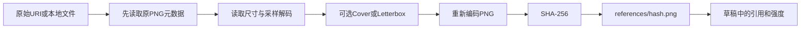

# 03 · 图片、蒙版与元数据

[返回架构总览](../PocketNAI-架构说明与功能拆解.md) · [请求协议](02-生成编排与网络协议.md) · [文件生命周期](04-数据历史与文件生命周期.md)

## 1. 分辨率的三种含义

| 数据 | 含义 | 消费者 |
|---|---|---|
| `CustomResolution` | 编辑器输入的宽、高与精确模式 | 输入框与说明 |
| `params.size` | 提交给NovelAI的64对齐画布 | 请求、计费、参考底图变换 |
| `params.outputSize` | 可选的裁切目标 | OutputImageProcessor |
| `GeneratedImage.width/height` | 已保存文件的真实尺寸 | 画廊比例、查看、导出 |

例如精确输入1920×1080：规划生成1920×1088，居中裁去上4下4行，最终文件1920×1080。收费按2,088,960像素画布算，不能按显示分辨率推断免费。

`ResolutionPlanner`规则：精确模式每边ceil到64倍数；非精确模式取最近64倍数，正中间取上值；对齐后检查最大面积3,145,728和本地最大边2048。`centeredCrop` 使用整数除法取左上偏移，奇数差额多裁右/下1像素。它只裁切，不重采样缩放。

`GenerateViewModel.applyCustomResolution` 是自定义编辑输入写入请求尺寸的集中入口。规划失败保留上次参数并显示错误。选Normal/Large退出Custom并清outputSize。Custom是UI选项，不是 `ResolutionTier.CUSTOM`。

当前两个实现细节不能沿用旧文档的简述：

- 规划器最小输入是64，但profile最小画布边为256。64–255区间可能规划成功、随后被profile规范化，见06。
- 从普通预设首次切Custom时，`exactOutput=params.needsCrop`，通常为false；并非README所说“总是默认精确”。

源码：[规划器](../../app/src/main/java/net/pocketnai/domain/image/ResolutionPlanner.kt)、[分辨率控件](../../app/src/main/java/net/pocketnai/ui/common/ResolutionSelector.kt)。

## 2. 参考图的公共导入和图生图

来源只有两类：系统选图得到的URI，或历史图片的私有相对路径。`ReferenceSource` 屏蔽来源区别，`ReferenceImageImporter` 返回 `PreparedReference(path,width,height,byteSize,sha256)`。



公共实现先读图片bounds，按2的幂采样让解码最长边不超过4096；PNG预算8MiB，过大最多再增加采样尝试，仍失败则REFERENCE_TOO_LARGE。Bitmap使用ARGB_8888，处理IO/OOM/来源权限错误。这里的预算是PNG字节预算，Base64后约为4/3倍；不是“任意格式原文件最多8MiB”。

代码没有显式EXIF方向修正或统一ICC色彩管理；原生重写不能假定平台解码器自动产生相同方向和颜色。正常照片、透明图、带方向标签的JPEG都应进入验收样本。

图生图选图流程先探测metadata，再导入保存；在非Custom模式按源图长宽比选当前profile的预设画布，Custom则保持用户画布。成功挂图清Precise和旧蒙版，允许保留Vibe。默认strength=0.7。

提交时才将起点图Cover到最新 `params.size`，因此改分辨率无需重新选普通图生图底图。Cover取较大缩放比例、居中裁去超出部分。不是把原文件路径直接上传，也不是使用outputSize处理底图。

## 3. Precise Reference

仅V4.5开放，最多4张。导入就调用 `ImageTransform.DirectorCanvas`，根据比例选择：竖1024×1536、横1536×1024、近方1472×1472；近方区间由 `ImageGeometry` 的1.1比例带决定。

Letterbox按较小比例缩放、黑色背景居中放置，并**禁止把小原图放大**（effectiveScale不超过1）。所以小素材可能四边都有较大黑边，这与普通“总是填满一个方向”的fit实现不同。

缩略图显示已经补边的提交素材。发送前再次做同目标Letterbox是恒等操作。每条参考独立保存kind、strength、secondaryStrength/fidelity、informationExtracted，后三者默认1.0，范围0–1。删除参考后重排ordinal，避免请求数组索引错位。

挂Precise会清图生图、Vibe、蒙版。与图生图互斥是当前产品限制；与Vibe不能混发是仓库记录的协议约束。不要因为三个页签可以自由切换就认为能同时发出所有条件。

## 4. Vibe Transfer

仅V4.5，客户端最多4张。导入仍进行解码和PNG归一化，但不做Precise画布补边；所谓“原图交给编码”指不做额外条件画布变换，不是源文件字节原样上传。

每张默认strength=0.6、informationExtracted=1.0。Normalize操作只有总strength>1时按比例缩到1；总和≤1不变，单张0.6也不会自动升到1。

用户点击生成后，仓库计算：

`cacheKey = SHA256(model.apiModelId + "|" + reference.sha256 + "|" + informationExtracted.toString())`

若 `files/vibes/<cacheKey>.vibe` 存在，直接读并Base64。否则读取PNG的Base64，POST encode-vibe，保存二进制，再Base64进入生成请求。缓存键不含strength，所以仅改变strength可复用编码；换模型或信息量会重新编码。

报价的 `isVibeEncoded` 使用同一键和文件存在判断。这里没有对缓存内容完整性或服务端编码版本做额外核验。跨语言如需复用旧cacheKey，浮点文本格式和UTF-8必须一致；不要求旧缓存互通时可使用更明确的新版本键。

挂Vibe保留图生图底图，清Precise和蒙版。Vibe没有独立GenerationMode：纯Vibe仍标TXT2IMG，图生图+Vibe标IMG2IMG，详情依参考列表补充信息。

## 5. 局部重绘

### 5.1 准备与互斥

入口为画廊长按菜单、详情操作或图生图卡片编辑蒙版。`onInpaintBasePicked` 先按当前请求画布Cover并保存新底图，清其他参考条件和旧蒙版，默认strength=1.0。导航需区分底图异步准备中、失败和就绪，不能首次读不到底图就退出。

有底图且有蒙版时才判定INPAINT。换底图/移除底图必须同时废弃蒙版。只挂底图但未完成蒙版时仍按图生图判定。更改尺寸后如何处理已有蒙版，当前缺少统一重新绑定，列为06的验收边界。

### 5.2 编辑器的坐标和笔画

`MaskStroke` 记录橡皮标志、半径和位图像素坐标点。屏幕fit比例 `min(viewWidth/bitmapWidth, viewHeight/bitmapHeight)`，居中偏移为剩余宽高一半。触点换算为 `(viewPoint-offset)/scale` 并限制在位图边界。屏幕笔刷半径同样除以scale，不能把dp或屏幕像素直接存为蒙版半径。

工具包括画笔、橡皮、大小4–160、扩张0–24、撤销、重做、清空确认。撤销/重做管理笔画列表，预览按列表重画；新笔画使旧redo分支失效。扩张是画笔半径加N，橡皮不扩张。预览与落盘共享几何规则，但预览可以平滑，最终蒙版必须二值硬边。

当前顶部返回按钮也走save闭包。save成功把渲染文件引用交回生成页；原始笔画与扩张保存在内存ViewModel。渲染失败仍调用onDone，当前代码没有把失败结果明确传入referenceError，见06，不能假定所有保存失败都会正确可见。

### 5.3 最终蒙版

落盘用不透明黑底、白色重画，橡皮画回黑色；关闭抗锯齿，圆头圆角笔画。完成后使用最近邻缩小到宽高1/8，再最近邻放回，产生8×8隐空间网格对齐。当前仅当宽高均可被8整除时执行。

输出PNG与底图等尺寸，保存到内容寻址references目录。请求是infill + 专用inpainting模型，不可用img2img+mask代替：普通图生图可能成功但忽略mask，破坏整图。

8像素蒙版网格和64像素生成尺寸是两个不同约束。最终输出裁切仍在服务器返回后统一执行。

源码：[几何](../../app/src/main/java/net/pocketnai/domain/inpaint/MaskGeometry.kt)、[蒙版落盘](../../app/src/main/java/net/pocketnai/data/image/MaskImageProcessor.kt)、[编辑器](../../app/src/main/java/net/pocketnai/ui/inpaint/InpaintEditorScreen.kt)。

## 6. PNG元数据导入

### 6.1 读取

图片重新压成PNG会丢文本块，因此探测必须发生在ReferenceImageProcessor之前。Android inspector只负责取得输入流/识别格式，domain的 `PngTextChunks` 读取tEXt/zTXt/iTXt，支持受限解压。单块文本1MiB、解压1MiB、文本总量2MiB，PNG声明chunk长度额外限制64MiB。

只有Software包含NovelAI才认定来源。Comment无法解析时仍可识别NovelAI图片，但可导入参数少。当前元数据探测返回非PNG格式结果，不过选图ViewModel只对Found弹对话框，其他结果一般静默；不要沿用README“每个不支持格式都有明显提示”的保证。

### 6.2 字段优先级

- 正向：Description → Comment.prompt → v4_prompt.caption.base_caption。
- 负向：v4_negative_prompt的基础caption → uc。
- 实际展开值：actual_prompts里的prompt/uc，兼容对象与字符串。
- 参数：width/height/steps/scale/cfg_rescale/sampler/noise_schedule/seed等白名单。
- 模型：Source的名称与hash映射，不从任意Comment字段反射请求。
- 角色：正向列表按索引配负向和坐标，只用于报告；导入Planner未生成角色修改。

`NovelAiModelHashes`当前有部分未知hash回落Curated的逻辑（例如可识别V5名称但不在Full集合），不是所有未知Source都保持模型不变。此策略可能误认未来模型，见06。

### 6.3 计划、预览、确认

`MetadataImportSelection` 默认选提示词/负向/设置，不选Seed、实际展开文本、Clean Imports。Planner是纯函数，产生可应用字段和逐条notes；确认一次性写入编辑器，不自动生成。

合法但不在预设的画布按Custom接收，不取近似预设；不合法则不导入并说明。采样器/调度和范围要按目标模型验证。Seed导入后变为FIXED。质量后缀按`|`分块检查：每块都匹配同一已知后缀才剥离并设置对应选项；否则原文保留且质量标签None。Clean Imports会删除花/方括号，改变权重，所以默认关闭。

图片不包含可恢复的原底图、完整Vibe编码或Precise源文件；只能说明使用过参考条件，不能生成伪引用。UC preset也无法从已经合并的负向文本完整反推。

## 7. 输出裁切与元数据保全

`OutputImageProcessor.apply` 在commitImages之前处理结果。无crop直接返回原图片对象，不重编码，hash/字节保持一致。有crop时解码原PNG，按单一centeredCrop规则裁切，压PNG，再写回白名单文本和本地变换说明。

白名单为Software、Source、Description、Comment、generation_time、Title对应标准化键；原Comment里的width/height仍是生成画布，不能改成最终尺寸。另写：

```text
pocketnai_output=output=1920x1080;generation=1920x1088;crop=0,4
```

这里等号左侧是PNG文本keyword，右侧是文本值。写入器计算文本chunk CRC并插在IEND之前。裁后重新计算byteSize、SHA-256和真实宽高。

**现有降级行为**：读图/解码/裁切/写入失败时，cropImage返回null，apply保留未裁原图。这样保住了图片，但不能保证用户最终拿到精确尺寸。目前没有独立“裁切未完成”事件。原生实现应明确决定是否保图并提示、标记部分成功或阻止提交，不能静默宣称尺寸保证成立。

## 8. 建议携带到新平台的图像样本

固定尺寸/方向/颜色的本地样本应覆盖：横竖方、比画布小的Precise图、透明PNG、含EXIF方向JPEG、超大图降采样、奇数差裁切、空/单点/多笔画/橡皮蒙版、8×8边缘、压缩与国际文本块、损坏或超限文本、非PNG元数据、未知模型Source。

无需服务端调用就能验证：几何矩形完全一致；蒙版黑白像素与边界正确；无裁切字节不变；裁切后参数可重读；显示尺寸、磁盘尺寸、数据库尺寸一致。
