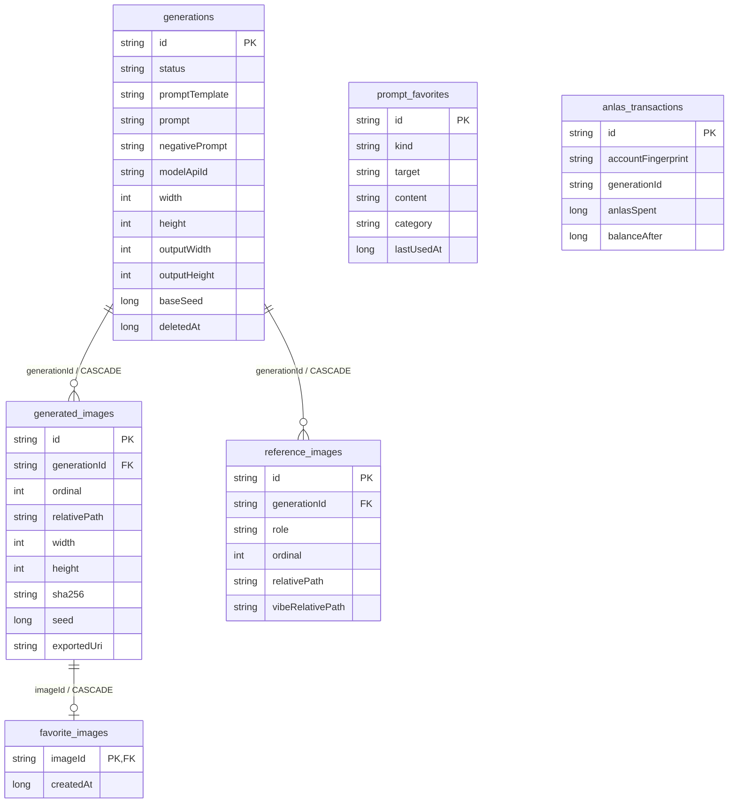

# 04 · 数据、历史与文件生命周期

[返回架构总览](../PocketNAI-架构说明与功能拆解.md) · [生成编排](02-生成编排与网络协议.md) · [账号与费用](05-账号计费代理与更新.md)

## 1. 存储分工

| 存储 | 内容 | 生命周期 |
|---|---|---|
| Room `pocketnai.db` | 生成父记录、图片索引、参考关联、两类收藏、流水 | 长期本地历史 |
| `files/generations` | 实际生成/放大图片 | 随图片或生成记录删除 |
| `files/references` | 已归一化参考图、底图、蒙版 | 按完整活引用集合回收 |
| `files/vibes` | encode-vibe产物 | 按完整活引用集合回收 |
| `cache/incoming` | ZIP和待提交图片 | 操作收尾/下次维护清理 |
| `cache/previews` | SSE预览 | 生成结束/失败/恢复清理 |
| `cache/updates` | 下载的APK及.part | 更新专用缓存 |
| 草稿首选项 | 编辑模板、参数、素材路径、角色 | 被新草稿覆盖 |
| 设置首选项 | 主题、订阅覆盖、预览开关、更新忽略版本 | 用户设置 |
| `pocketnai_secure` | 凭据密文、多账号索引及提示信息 | 安全存储，备份排除 |
| `pocketnai_proxy` | 代理设置、加密密码、今日字节数 | 本机配置 |
| 内存余额仓库 | 服务器余额和查询状态 | 会话级，切账号清理 |

图片以相对路径存数据库，运行时由fileStore解析为应用私有目录下的文件；不把Android绝对路径写成跨平台数据契约。草稿和历史有提示词等用户内容，并不因为“不是Token”就属于公开数据。

## 2. 数据库六张表

当前schema为7，完整字段定义见 [实体目录](../../app/src/main/java/net/pocketnai/data/local) 和 [导出schema](../../app/schemas)。



图中只列关键字段，不替代schema；例如生成父记录还有采样器、调度、步数、Guidance、CFG、质量标签、UC、版本、错误与更新时间，参考表还有强度和尺寸等。

### 2.1 生成与图片必须分开

一条 `Generation` 对应一次请求，一次可出多图。`GeneratedImage`才是文件单位。父记录有请求画布和可选输出目标，子图记录是真实宽高、大小、hash、逐图Seed和导出URI。收藏针对图片；删除入口却可能针对整次生成，后面详述。

历史保存基础提示词和qualityTags选项，不保存完整HTTP JSON。`requestSnapshotVersion`是协议版本数字，不代表有全量JSON快照；`modelConfigVersion`也是能力表标识。`metadataJson`列在普通生成中写null；PNG文件本身仍可有服务器元数据。

`GenerationParams.characters`没有对应实体列；负向Randomizer原模板也没有历史列。映射器读未知model/sampler/schedule/status/seedMode时可能返回null，使部分上层查询跳过该历史。不能把现有模型描述成无损、可跨未来版本解析的完整任务档案。

### 2.2 参考关联与共享素材

一条参考关联的主键为 `<generationId>:<role>:<ordinal>`，不使用素材id，因为同一个素材会被多个生成记录使用。参考文件按内容hash共用，关联行按生成场景区分强度、kind和顺序。

数据库删除某父记录级联删关联行，但不直接删共享参考文件。素材存活查询包括 `relativePath UNION vibeRelativePath`，再加持久草稿里的素材路径。少一个来源就会误删可复用素材。

### 2.3 账目不随图片删除

`anlas_transactions.generationId`只是可空文本，没有外键。流水不会因删除历史图片级联消失。`accountFingerprint`用于标注来源，但默认最近流水查询不按当前账号过滤。生成/图片/收藏/草稿没有账号列，当前多账号共用本机历史，不是多租户数据库。

### 2.4 DAO方法名称不能替代SQL语义

若干方法叫`upsertGeneration/upsertImages`，实际是 `INSERT ... IGNORE`，不是覆盖更新。状态变更走显式UPDATE。没有把“父记录、参考行、图片行、最终状态”包成一个统一Room事务。

## 3. 文件提交与恢复

```text
files/
  generations/<generationId>/0001.png, 0002.png, ...
  references/<sha256>.png
  vibes/<cacheKey>.vibe
cache/
  incoming/<generationId>/response.zip, 0001.png, ...
  previews/<generationId>/0001.png
  updates/PocketNAI-<versionCode>.apk
```

正式图通过`.part`写入再rename；rename失败退化copy+delete，因此只能称“暂存后提交策略”，不是跨文件系统严格原子性保证。参考/Vibe内容寻址写入也采用.part，同名同大小文件直接复用，不每次重算已有文件hash。

普通生成先有GENERATING父记录，后有正式文件，最后写图片行和状态。提交后才清ZIP/incoming/preview。若中途崩溃：

| 中断点 | 下次恢复的现状 |
|---|---|
| 仅有临时文件 | incoming被清理 |
| 正式目录存在但数据库无这个generationId | 整个目录视为孤儿删除 |
| 父记录已存在，但图片行尚未写完 | 目录因父id存在被保留；父记录标失败，未引用文件不一定逐文件回收 |
| 图片行已写、状态还是GENERATING | 下次标失败/结果不确定，不自动重发 |
| 图片行有但文件已失 | 计入missingImageFiles；没有自动找回服务端文件 |
| 已软删除但撤销窗口未结束 | 重启时完成永久删除，不跨重启保留撤销 |

`cleanupOnStartup`依次取得全部父id与参考活集合、清孤儿目录和incoming、清所有预览、清软删除、标记遗留GENERATING、统计缺图。该方法也被设置维护调用，不只是首次启动；当前没有全局任务锁隔离活跃生成，详见06。

`usedBytes`只加总generations/references/vibes，不包括数据库、首选项、图片加载器cache、APK或临时ZIP。因此设置显示的是这一组私有图片占用，不是系统设置中的应用总空间。

## 4. 画廊、检索与收藏

DAO的画廊查询连接子图和父记录，排除父记录deletedAt非空者，按图片createdAt降序、ordinal升序。参考表不参加该JOIN，避免一图因多参考产生重复行。生成中卡来自另一条父记录Flow，只取GENERATING，和正式图分开显示。

`GalleryViewModel`组合全量画廊、收藏id集合和筛选条件，以纯函数 `GallerySearch.matches`过滤：

- model、mode、仅收藏、关键词同时满足。
- 关键词当前只匹配 `item.prompt`，不搜索标题、负向词或角色词。
- 大小写不敏感，下划线等价空格；空格/逗号/换行/制表/中文逗号分词，各词全部命中。

`GalleryTimeline`按系统时区把图片时间转日期，分今天、昨天、本年M月d日、往年yyyy年M月d日。每组保留输入顺序，组按日期降序。当前一次订阅获取全量列表，没有分页和全文索引；这对个人规模简单直接，但大图库重写需单独做性能验收，优化不能改变搜索语义。

图片收藏表以imageId为主键；toggle仅改收藏关系。软删除期间子图未消失，收藏仍在；撤销后自然恢复。硬删子图通过外键级联删收藏。

多选集合存imageId：全选针对当前结果；批量收藏在“全已收藏”时取消全部，否则统一设收藏；批量保存与分享针对所选文件。批量删除目前转换为generationId集合，含义不同。

## 5. 详情、复用与查看

点开卡片时把当前筛选结果的id列表写到GalleryOrderSnapshot。详情绑定这份固定顺序；新生成图片或主画廊筛选变化不会让当前翻页突然跳位。当前id不在快照时退化为单图。

DetailViewModel按需加载每页，缓存 `details`，跟踪inFlight与failedIds避免重复加载，同时订阅当前图收藏状态。详情组合图片、父记录和单独查询的参考列表。当前详情尺寸行读的是父params.size，裁图或放大图的显示需注意03/06指出的尺寸区分。

全屏查看为Fit基础图，手势缩放1–8倍，双击在1与2.5倍间切换并围绕点击位置补偿平移，单击关闭；平移限制取自实际图片显示矩形，旋转/改变容器大小后重新计算。

“复用参数”通过GenerationDraftStore投递一次请求，只填编辑区。正向复制走系统剪贴板，分享走文件授权；这些都不读取Token。超分新图在详情列表中插入当前项之后；详见02。

## 6. 删除、撤销和清理的区别

| 操作 | 单位 | 撤销 | 系统相册副本 |
|---|---|---|---|
| 画廊删除/批量删除 | 当前实现为generationId整批 | 约5秒内可撤销 | 不动 |
| 详情删除 | 当前图所属整次generation | 确认后立即永久删除 | 不动 |
| 设置清理，保留收藏 | 单张未收藏图片，随后删空父记录 | 无 | 不动 |
| 设置清理，包含收藏 | 全部生成历史与文件 | 无 | 不动 |
| 孤儿维护 | 没有活引用的文件/遗留临时数据 | 无 | 不动 |

画廊删除先写deletedAt，UI立即隐藏；ViewModel延迟5秒调用purgeDeleted，撤销取消定时并restore。该purge会清**全部**软删除记录，而不只当前这批；新删除会替换本次undo集合。这不是通用回收站。

特别是某次生成出四张、只选其中一张删除时，当前实现仍删除四张所属父记录。文档必须保留这个真实语义，让新平台决定是兼容整批还是明确改为单图删除；不能简单把按钮画成“删除1张”而沿用旧调用。

设置“保留收藏”则确实按子图删除，SQL按未收藏id查询，500条一组删除，随后移除没有图片的父记录并回收孤儿。默认保留收藏。清理路径未区分UPSCALE和普通生成，未收藏的放大图也在范围内。

源码：[画廊状态](../../app/src/main/java/net/pocketnai/ui/gallery/GalleryViewModel.kt)、[仓库删除和清理](../../app/src/main/java/net/pocketnai/data/repo/GenerationRepository.kt)。

## 7. 导出与分享

保存相册复制最终PNG原字节，不重新编码，所以保留已有metadata。Android10+使用MediaStore：插入IS_PENDING条目 → 写文件 → 清IS_PENDING，失败尽量删除半成品。Android9及以下写Pictures/PocketNAI，按需申请WRITE_EXTERNAL_STORAGE，重名加序号并通知媒体扫描。成功将exportedUri写回子图；再次保存并无完整跨平台去重保证。

分享通过FileProvider短期只读URI，单图ACTION_SEND、多图ACTION_SEND_MULTIPLE；缺失/空文件过滤。共享根只有 `files/generations/` 和 `cache/updates/`，不包含数据库、参考素材、凭据文件。分享完成不等同于保存相册，也不把exportedUri当共享状态。

导出的相册副本由系统/用户管理，本地删除不追删。跨平台应保持这一所有权边界，避免把图片历史清理变成用户文件夹清空。

## 8. 数据迁移

| 版本 | 迁移内容 |
|---|---|
| 1→2 | generations新增可空qualityTags，按旧boolean回填；旧列继续保留 |
| 2→3 | 新建prompt_favorites |
| 3→4 | 新建reference_images；generations新增mode并回填TXT2IMG |
| 4→5 | 新增可空outputWidth/outputHeight |
| 5→6 | 新建favorite_images |
| 6→7 | 新建anlas_transactions及createdAt索引 |

禁止DROP/RENAME重建generations：子表CASCADE会导致图片记录损失。Room校验要求实体含遗留列，不可因“用不上了”删除qualityTagsEnabled。升级使用显式Migration，无破坏性兜底。

跨平台选择新的数据库工具并不要求直接打开Android库，但若提供旧数据导入，应以独立格式版本的manifest保存父子id、相对路径、真实图片校验和、请求画布/目标/实际尺寸、参考关联和收藏；文件与记录作为一个整体校验。当前项目没有现成的此类导入导出包，不应声称已支持迁移。

Android Room使用WAL；离线取证只复制主db可能缺最新数据。迁移测试在裸SQLite上验证CASCADE要手动启用foreign_keys。凭据不应随普通历史包迁移，目标设备重新连接。
