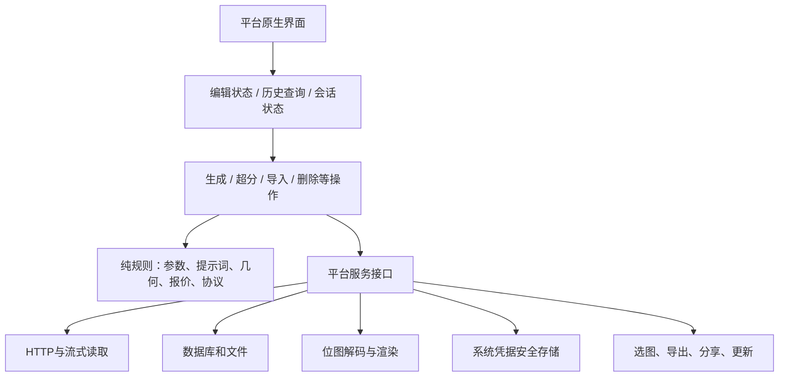

# 06 · 原生移植边界、现有缺口与验收

[返回架构总览](../PocketNAI-架构说明与功能拆解.md) · [源码与测试索引](07-源码与测试索引.md)

## 1. 本章的范围

本章提供现有实现的职责映射和行为验收依据，不启动SwiftUI或Windows工程，也不替用户选定Windows语言/框架。SwiftUI是UI框架，Swift是语言；Windows没有唯一的“原生语言”，具体语言、UI框架、最低系统和分发渠道仍需后续决定。

下表是移植边界，不是已实施的新平台架构，也不承诺某套网络库具备全部代理能力。正式选型时应结合目标系统重新核验平台API。

## 2. 应等价重写和应平台适配的部分

| 职责 | Android现状 | 原生重写时保留的契约 |
|---|---|---|
| 能力表/参数 | ModelCatalog、ModelProfile | API模型ID、数值范围、默认值、兼容组合、版本 |
| 提示词 | PromptComposition/Randomizer/Scanner | 字符串规则、选区范围、抽选时机、质量去重 |
| 生成编排 | Repository冷Flow + ViewModel | 单次提交、冻结快照、唯一Seed、状态与不确定结果 |
| HTTP JSON | kotlinx.serialization + OkHttp | 字段、缺省、省略、数组对应、数字类型 |
| SSE/ZIP | JVM解析器与流IO | 帧边界、有限额读取、图片校验、不得重放付费操作 |
| 费用 | domain/billing | 两次ceil、免费张数、附加费、Unknown语义 |
| 图片几何 | domain/image/inpaint | 像素坐标、Cover/Letterbox差别、裁切取整、8×8网格 |
| PNG metadata | 自定义读写器 | 白名单、优先级、原Comment保留、文本限额 |
| 安全凭据 | Android Keystore + prefs密文 | 系统安全存储、会话类型、先验证再切换、不导出密钥 |
| 草稿/设置 | SharedPreferences + JSON | 持久化字段、容错、版本、适当延迟与退出刷新 |
| 历史 | Room/SQLite | 父子关系、显式迁移、引用回收、无破坏性升级 |
| 图片渲染 | Bitmap/Canvas | 与几何规则一致，明确方向、透明度、色彩管理 |
| UI状态 | Compose/StateFlow/ViewModel | 持有者生命周期、外部替换代数、主线程UI更新 |
| 选图/导出/分享 | Photo Picker、MediaStore、FileProvider | 用户选择授权、复制文件、不扩大共享范围 |
| 更新/安装 | APK、PackageManager、安装Intent | 版本比较、签名信任、缓存、明确交给系统安装 |

SwiftUI可沿“应用级状态对象 → 各功能状态对象 → 纯规则 → 系统服务适配器”表达；Windows同样应让窗口/UI状态与生成任务服务分离。语言不同不意味着必须复制Android的生命周期漏洞或目录层次。

## 3. 跨语言最容易出现的细小不一致

1. **Unicode。** Access Key用前6个Unicode码位；编辑选区目前是UTF-16索引，而Swift字符串下标不是整数。协议派生和UI选区是两种不同索引问题。
2. **数值。** Seed为0…2³²−1，应使用足够宽的整数；seed−1在0时为−1，当前请求如此发送。像素面积与费用使用64位整数，不能先在32位乘溢出。
3. **舍入。** 分辨率ceil64、nearest64平局向上、裁切左上floor、费用双ceil、蒙版最近邻采样分别独立。不要统一为语言默认round。
4. **省略与null。** JSON未发送的字段和显式null/0不一定同义；图生图不能顺手补noise/color_correct等默认字段。
5. **随机。** 测试可注入固定随机源；生产随机Seed和Randomizer抽选不要求不同语言默认PRNG序列相同，但一次操作快照必须一致。
6. **文件hash。** 图片归一化重编码后字节hash可能随平台编码器变化；hash是内容寻址文件身份，不代表视觉上同图一定跨平台同hash。
7. **缓存键。** 浮点 `1.0` 与 `1`、枚举apiValue和大小写会改变Vibe键；决定是否兼容旧缓存后再定格式。
8. **日期。** 历史分组用用户当地时区；订阅expiresAt按秒，历史createdAt按毫秒。不能混用。
9. **异步流。** 生成冷流只应被执行一次；用于UI展示的共享状态可多订阅。切页面、取消订阅、重复订阅都不应隐式新建付费请求。
10. **任务与账号。** 一次任务需要固定凭据身份、参数和报价背景；显示当前账号是另一种状态，不能在收尾时随手读取当前值覆盖来源。

## 4. 当前实现的限制与待决策项

以下是本次静态审阅直接发现的行为或由调用顺序推导出的风险，**不是本次已做运行复现的故障清单**。这些地方不在本次修改范围内。后续应先决定产品语义，再写测试和修复，避免把限制复制进新平台。

### 4.1 数据完整性与图片语义

| 编号 | 当前源码事实 | 影响与需要决定的事 | 入口 |
|---|---|---|---|
| D01 | 历史Entity/Mappers没有characters；草稿有 | 多角色历史复用不完整；确定新历史快照字段与迁移 | `GenerationEntity`、`Mappers`、`GenerationDraftCodec` |
| D02 | 复用使用params.prompt而非promptTemplate，负模板无历史列 | 复用展开结果还是原模板应明确；精确复现还需切固定Seed | `GenerateViewModel` pending消费 |
| D03 | 批量删除imageIds被转为generationIds；详情同样删父记录 | 选一张可能删除同批其他图；新平台须明确单图/整批语义 | `GalleryViewModel.batchDelete`、`DetailViewModel.deleteGeneration` |
| D04 | OutputImageProcessor裁切失败返回原图 | 保存成功不代表精确尺寸达成；需可见的降级结果 | `OutputImageProcessor.apply/cropImage` |
| D05 | Planner最小边64，profile最小边256 | UI可接受与请求可提交不是同一范围；统一本地护栏 | `ResolutionPlanner`、`ModelCatalog` |
| D06 | 精确模式首次进入值来自needsCrop；无效Custom保留旧params；按钮未检查customResolutionError | 旧文档默认精确不准确；输入无效时仍可能提交上次合法尺寸，需决定禁用或明确提示 | `onCustomResolutionEnabled/applyCustomResolution`、`GenerateSheet` |
| D07 | 改尺寸入口没有统一废弃/重建已有蒙版；validate不查底图蒙版尺寸 | 可能出现底图Cover到新尺寸、蒙版仍旧尺寸；定义“改画布”原子操作 | `GenerateViewModel`尺寸入口、`GenerationRequest.validate` |
| D08 | 笔画栈只在内存；save渲染失败仍返回且未赋referenceError | 恢复蒙版不等于恢复可编辑笔画；失败提示需补闭环 | `InpaintEditorScreen` save、`GenerationDraftCodec` |
| D09 | 模式互斥主要靠挂图UI；validate缺少一般Vibe+Director冲突等检查 | 新入口或坏草稿可绕过部分约束；要把所有组合规则下沉到请求校验 | `GenerationRequest.validate`、参考挂图入口 |
| D10 | Source部分未知hash回落Curated | 未来模型或新Full hash可能被误认；决定严格未知策略 | `NovelAiModelHashes.resolve` |
| D11 | 元数据plan不恢复角色；探测非Found多静默 | 不应承诺完整参数无损导入或所有格式错误都显示 | `MetadataImportPlanner`、`onReferencePicked` |
| D12 | 元数据应用沿用旧outputSize，customResolution又按导入size重算 | 旧裁切目标与新画布可能残留混用；需用例钉住导入原子性 | `confirmMetadataImport` |
| D13 | 超分复制父参数，但真实新尺寸在图片行；详情尺寸读父params | 放大图/裁图需要同时显示生成和实际尺寸；超分复用语义单独定义 | `upscaleImage`、`DetailPageContent` |

### 4.2 任务生命周期、网络与恢复

| 编号 | 当前源码事实 | 影响与需要决定的事 | 入口 |
|---|---|---|---|
| R01 | 生成、超分没有应用级统一互斥或任务队列 | 页面各自防重不能保证全局只跑一项；多窗口更需集中调度 | 两个ViewModel、GenerationRepository |
| R02 | cleanupOnStartup在Activity创建和手动维护运行；没有活跃任务锁 | 可能清活跃incoming/preview或把活跃GENERATING标失败；恢复与维护应区分 | `MainActivity`、`SettingsViewModel.runMaintenance` |
| R03 | files提交与多次DAO写入没有统一事务/恢复日志；已知父id目录不会逐文件清孤儿 | 不能承诺崩溃后自动恢复所有结果；定义明确提交检查点 | `commitImages`、`GenerationDao`、`cleanupOnStartup` |
| R04 | 多处未catch数据库/非预期异常；inFlight收尾依赖事件 | 可能缺少UI结束事件；外围应保证一次操作总能进入明确终态 | `startGeneration`、`GenerationRepository.generate` |
| R05 | Vibe编码先于空间检查/父记录 | 主生成未发生也可能已付编码费；考虑独立子操作记账 | `vibeBase64For`调用顺序 |
| R06 | 流式成功不resetStreamingFailures | 现状为累计失败阈值而非真正连续失败 | `SettingsStore`、仓库流式分支 |
| R07 | SSE没有ZIP同等限额；streamError可否决已接收final | 需要单帧/总大小/已完成图保留策略 | `SseFrameReader`、`generateImageStream` |
| R08 | 普通IOException映射NETWORK_UNAVAILABLE；user/data复验用生成mapper | 部分断流和只读超时文案不准确；应按请求是否发送及操作类型分类 | 三套错误mapper与fetchAccountStatus |
| R09 | 底层图片编码器与文件resolve是Android具体实现 | 无法直接把Repository视为跨平台纯业务库；先定义平台端口 | `GenerationRepository`构造参数 |

### 4.3 账号、流水、代理与更新

| 编号 | 当前源码事实 | 影响与需要决定的事 | 入口 |
|---|---|---|---|
| A01 | clear清全部凭据首选项；多账号接口有默认假实现 | 断开/损坏恢复范围可能大于用户预期；接口必须要求完整实现 | `CredentialStore` |
| A02 | clear余额不取消旧Deferred；新refresh复用它 | 切换后可能短暂缺新余额；以会话代数隔离请求与结果 | `AccountBalanceRepository` |
| A03 | 生成收尾读当前编辑state与当前凭据hint记账 | 中途编辑/切账号时描述与账户归属可能错；冻结BillingContext | `refreshBalanceAfterGeneration` |
| A04 | 流水来源是余额差；缺失可记0；DAO写入没隔离异常 | 0不是免费证明；辅助账目不应影响已保存结果 | 两个ViewModel、`AnlasLedgerRepository` |
| A05 | 超分把返回图片id传入流水generationId | 关联语义不一致；独立命名sourceImageId/resultImageId/generationId | `DetailViewModel.upscaleImage` |
| A06 | 流水全局最近100；全局订阅覆盖和草稿 | 账号切换不是全数据隔离；需要明确产品范围 | `AnlasTransactionDao`、`SettingsStore` |
| A07 | quota在addTraffic/初始化按日期刷新，检查只读内存 | 跨午夜满额可能无法自行恢复；检查时也需日期语义 | `ProxyStore` |
| A08 | HTTP代理无407认证接线；failover使用共享连接失败时间戳 | 认证HTTP路径及并发POST安全需要独立测试，不可仅靠串行成功 | `AppContainer`、`ProxyNetwork` |
| A09 | 代理日志含异常message；生成错误detail保留响应片段 | 约定的脱敏保证强于现有所有分支；逐出口做结构化限制 | `ProxyFailoverInterceptor`、`NovelAiErrorMapper` |
| A10 | APK证书不可读时通过；未完整验证包名和版本 | 不能作为其他平台严格更新信任模型直接复制 | `UpdateDownloader` |
| A11 | 两个发布入口都读max+1，没有跨入口锁 | 同时发布可竞争编号；需串行化/保留编号机制 | 发布脚本与workflow |

这些事项中有些是现有行为选择，有些是实现缺口。文档不把它们一律称为“应照旧复制的需求”；而是让移植时有依据地确认、修复或兼容。

## 5. 可独立实现和验证的模块边界

建议的职责拆分是对现有业务的整理，不是新工程提交：

最小平台接口需要表达以下能力：

- 凭据存取和账号切换；不能返回默认假成功/失败掩盖未实现。
- 请求执行、有限额下载、SSE事件；返回明确的发送阶段和不确定失败信息。
- 生成记录、图片索引、参考关联、收藏、账目的持久化与事务。
- 图片解码、Cover/Letterbox、二值蒙版渲染、裁切与metadata写回。
- 草稿加载/保存、活参考集合、路径解析、暂存/提交/回收。
- 系统选图、文件导出、分享、包签名校验与安装。

编辑器不应直接拿数据库句柄或拼JSON；生成仓库不应知道密码输入框；报价器不应请求网络。每次操作最好携带一个不可变上下文：operationId、账号身份、冻结参数、参考版本、预估费用、前余额快照。它能解决当前多处读取“当前状态”引入的歧义。

## 6. 离线验收矩阵

所有自动化使用假API/本地Mock服务；不能自动发送真实生成、登录、Vibe编码或放大请求。所谓免费组合也不构成自动验证许可。

| 范围 | 必须验证的结果 |
|---|---|
| PST/登录 | 失败不保存/不切账号；派生向量逐字节一致；403/401/超时语义区分；密码不持久化 |
| 账号并发 | 旧余额迟到不能污染新账号；中途切账号不改任务归属；单账号损坏处理范围明确 |
| 模型/参数 | 四模型ID和inpainting映射一致；上下界、采样组合、旧草稿回退行为明确 |
| 输入 | 连续删除、中文组合输入、反向选区、收藏替换不跳光标；外部替换只执行一次 |
| Prompt | 逗号拼接、质量去重、Randomizer转义、权重范围/跨行显示一致 |
| Characters | 正负数组位置一一对应；空角色过滤；草稿和历史均满足选定恢复语义 |
| 参考条件 | 每一种允许组合与禁止组合都有用例；缺文件/缺底图/缺蒙版本地拦截 |
| 请求冻结 | 延迟假响应期间编辑参数、切页面、重新订阅，不改变载荷、不增加调用次数 |
| Seed | request、数据库、单图详情一致；批量未知seed不伪造 |
| 几何 | 奇偶裁切、Letterbox不放大小图、Cover、EXIF、透明度与颜色基准 |
| 蒙版 | 坐标缩放、橡皮、撤销、扩张、8×8对齐；换图/改画布废弃或明确重建 |
| ZIP | 路径穿越、超限、非PNG、空包、部分坏图；失败清理可预测 |
| SSE | 多data行、EOF尾帧、JPEG预览、PNG final、超限、final后断流、阈值计数 |
| 裁切 | 无裁切字节不变；裁后真实尺寸与metadata保全；失败必须可见 |
| 持久化 | 文件写后/图片行写后/状态写前逐点注入中断；重启不丢已确认记录、不重发 |
| 回收 | 两条历史共享参考、仅草稿引用、未保存草稿窗口、正在生成时维护 |
| 删除 | 一批多图选一张、包含收藏、撤销窗口、重启、设置清理；相册副本不被删除 |
| 画廊 | 全量筛选AND语义、下划线等价、日期时区、详情顺序冻结、缺文件占位 |
| 导出/分享 | PNG字节一致、重名、权限拒绝、部分失败、仅授权目标文件 |
| 报价 | 免费1张、V5额度、Precise按输出张数、Vibe缓存、强度、未知/溢出、超分边界 |
| 流水 | 余额刷新失败/延迟/充值/异地消费不能冒充确定账单；写账异常不影响结果 |
| 代理 | 未发请求才允许重试POST；HTTP认证；并发连接；跨午夜额度；日志脱敏 |
| 更新 | 新/旧/坏tag；缺附件；错误签名/无法读取签名；中断下载；错误包身份；授权回来重用文件 |
| 平台UI | 手机/平板或窗口缩放、键盘/鼠标/触摸、深浅主题、多窗口状态隔离 |

## 7. 本次验证范围与后续使用方式

本次验证是源码与文档交叉核对、功能覆盖检查、链接和文件索引检查。没有修改应用代码，因此没有为了文档变更重装模拟器或触发完整构建；文档中的现有测试名称表示代码库提供这些测试，**不等于本次全部执行通过**。

后续修改Android代码仍按AGENTS约定执行单测 → assembleDebug → 安装模拟器 → 需要时截图。仪器化测试之前检查保留APK设置，避免测试结束卸载清空用户历史/凭据。联网SOCKS探针是仓库单独列出的例外，不能顺手包含在默认全量测试运行中。

使用本文开始移植时，先确认目标系统/语言/最低版本/分发方式、数据是否与Android互通、上述待决策项的期望语义，再把离线用例建立为新平台验收基线。真实账号和付费操作的最终体验验证留给用户明确手动触发。
